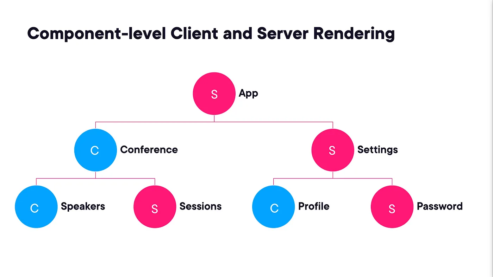

### https://next-blog-app-gilt.vercel.app/

This is a [Next.js](https://nextjs.org/) project bootstrapped with [`create-next-app`](https://github.com/vercel/next.js/tree/canary/packages/create-next-app).

## Getting Started

First, run the development server:

```bash
npm run dev
# or
yarn dev
# or
pnpm dev
```

Open [http://localhost:3000](http://localhost:3000) with your browser to see the result.

You can start editing the page by modifying `app/page.tsx`. The page auto-updates as you edit the file.

This project uses [`next/font`](https://nextjs.org/docs/basic-features/font-optimization) to automatically optimize and load Inter, a custom Google Font.

# Next 13

## Серверные и клиентские компоненты



### Правила вложения

- нельзя импортировать серверный компонент внутри клиентского
- можно пробрасывать серверные компоненты в клиентские как `children`


Используйте клиентские компоненты когда:

- необходимо использовать хуки
- когда необходимы обработчики событий на пользовательские действия
- при использовании браузерного API
- когда используется классовый компонент

Используйте серверные компоненты, когда:

- вы получаете данные через серверное API
- когда нужен прямой доступ к ресурсам бэкенда
- когда используется sensetive информация (ключи API, токены и пр.)
- когда используются тяжелые зависимости
